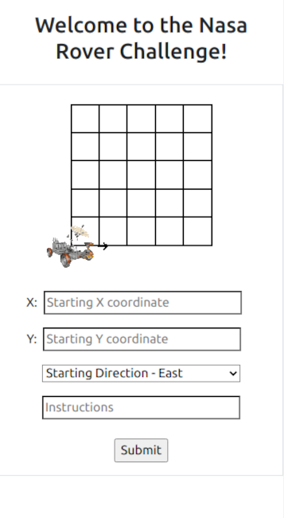

> This project is an answer to the Nasa Rover coding challenge. It uses a Ruby on Rails architecture and a PostgreSQL database, with HAML and Stimulus for front-end structure and DOM manipulation.

# Rover Challenge

## Project Description

The project is a coding challenge to solve the Nasa Rover problem. In it, you are given initial coordinates, such as [1, 2, 'N'] - for the X axis, Y axis, and Heading, as well as a set of instructions as 'L' - for Left, 'R' - for Right, or 'M' - for Move, in a single string, as such: 'LMLMLMLMM'. Using this information, a final X, Y, and Heading position should be ascertained. In this case [1, 3, 'N'].

In this project, I was expected to put my best work forward and part of what I believe encompasses my 'best work' is not just the ability to accomplish a task but also to do so even when faced with unfamiliar technology. As such, I chose to work with Stimulus (my second project with it, the first being nearly a year ago).

## Mobile View

  
  

## Desktop View

  

#### Features
-   Responsive layout works well on mobile or desktop
-   Rover coordinates can be input through form or through the interactive grid
-   Rover stays locked to its grid position despite active screen resizing
-   Rover can not move outside of its 5 x 5 grid
-   Form inputs respond to changes enacted by interactive grid and vice versa
-   All calculations are stored for future review and visible in the results index
-   Rover movement logic has been extracted into a gem

###### Coming Features
-   Interactive results to show rover move with each instruction step 

###### Known Bugs
-   Rover screen position is calculated based on grid screen position. Scrolling down and partially obscuring the view of the grid alters this calculation and positions the rover above the expected grid point. Scrolling up and repositioning the rover clears this bug.
-   Error reporting for Y coordinate input fires twice. The first iteration activates an error if an input is outside the accepted range but once the unacceptable input is cleared, the error clears and so it never shows to the user. X coordinate error reporting works just fine.

###### TODO
-   Increase testing of Stimulus controllers
-   Fix known bugs

### To Use The App
Upon loading the site, a 5 x 5 grid is displayed, with an image of a rover in the bottom left corner facing right. This is position [0, 0, 'E']. Users may input the starting X position, starting Y position, and instructions by using the form ('E' is input by default but may be changed with the select input). Alternatively, users my click the grid position they wish the rover to start on and click the rover itself to rotate its orientation to North, East, South, or West in a clockwise motion. Instructions may only be input through the form, in which only the letters 'L', 'R', or 'M' will be accepted inputs. Starting positions may only be 0 - 5, any input outside this range will not be accepted. Once the form is filled out by either method, press Enter or click 'Submit' at the bottom to find out where your rover may end up!

## Live Demo
#### Deployed on: 

## Built With
### Back-End
-   Ruby / Ruby on Rails
-   PostgreSQL

### Front-End
-   JavaScript / Stimulus
-   SCSS / Bootstrap
-   HAML

### Testing Suites
-   RSpec
-   Jest

### Linters
-   Rubocop
-   ESLint 
-   Stylelint 
-   HAML-Lint

## Getting Started Locally
### Prerequisities
To get this project up and running locally, you must have the necessary packages to run Ruby on Rails already installed on your computer, or be able to install them.

**To get this project set up on your local machine, open a command line terminal and follow these steps:**

**Step 1**
Navigate to the local folder where you want the repository to be cloned and run
`git clone https://github.com/defoebrand/rover_challenge.git`. 

**Step 2**
Next, run `cd rover_challenge`.

**Step 3**
Run `yarn install` to ensure necessary package installation.

**Step 4**
Run `bundle install` to ensure necessary gem installation

**Step 5**
Run `rails db:create` and `rails db:migrate` to create the necessary database schema.

**Step 6**
Run `rails s` to begin the server.

**Step 7**
Navigate to `http://localhost:3000/` in a browser of your choice to see the application running.

### Testing
##### Back-End
This project uses RSpec for testing Rails features.
> To run tests, open a terminal inside the project's root directory and enter `rspec`

##### Front-End
This project uses Jest for testing Stimulus features.
> To run tests, open a terminal inside the project's root directory and enter `yarn test`

### Linting
##### Ruby
This project uses Rubocop for linting Ruby code.
> To run the linter, open a terminal inside the project's root directory and enter `rubocop .`

##### JavaScript / SCSS
This project uses ESLint for JavaScript code and Stylelint for SCSS files.
> To run the linters, open a terminal inside the project's root directory and enter `yarn run linter-check`

## Author

👤 **Brandon Defoe**
-   Github: [@defoebrand](https://github.com/defoebrand)
-   LinkedIn: [@defoebrand](https://www.linkedin.com/in/defoebrand/)
-   Gmail: [defoe.brand](mailto:defoe.brand@gmail.com)

## 🤝 Contributing

Our favorite contributions are those that help us improve the project, so please leave an issue or a feature request if you have any suggestions!

Feel free to check the [issues page](https://github.com/defoebrand/rover_challenge/issues) to either create an issue or help us out by fixing an existing one.

## Show your support

If you've read this far....give us a ⭐️!